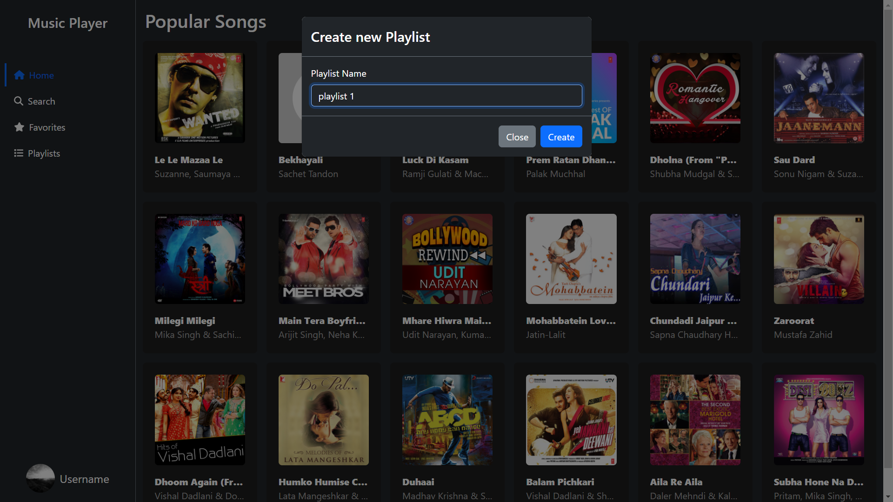

This is simple music player UI built with ReactJS. It uses the [shazam API](https://rapidapi.com/apidojo/api/shazam) to fetch the music data.

The features include:

- Search for music and artist
- Play music (redirect to the music source)
- Create playlist
- Add music to playlist
- Remove music from playlist
- Play music from playlist
- add music to favorite
- remove music from favorite
- play music from favorite

# Demo

## home


## create new playlist



## add music to playlist


# search


# playlist


# favorite


# Install dependencies
```bash
yarn install
```

# add env variables

```
REACT_APP_RAPIAPI_KEY=<your key>
REACT_APP_RAPIDAPI_HOST=<your host>
```

# to run the app in development mode

```Bash
yarn start
```

# to build the app

```
yarn add -g serve
yarn build
serve -s build
```